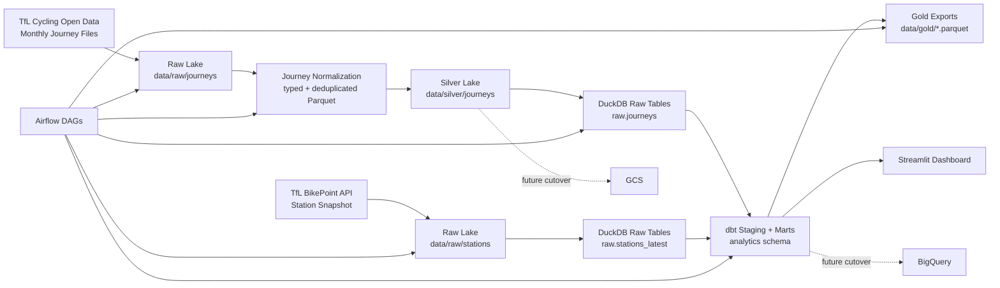
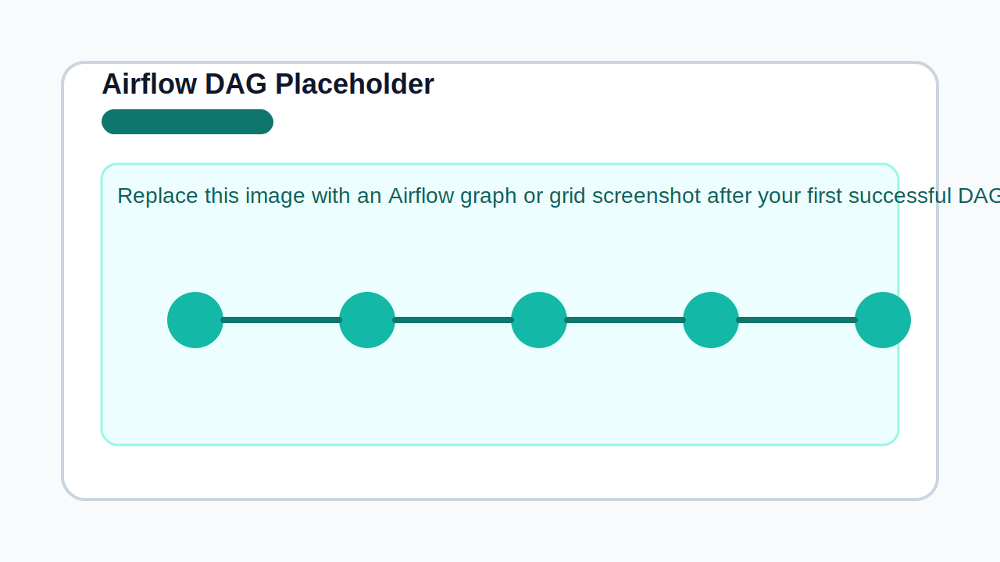
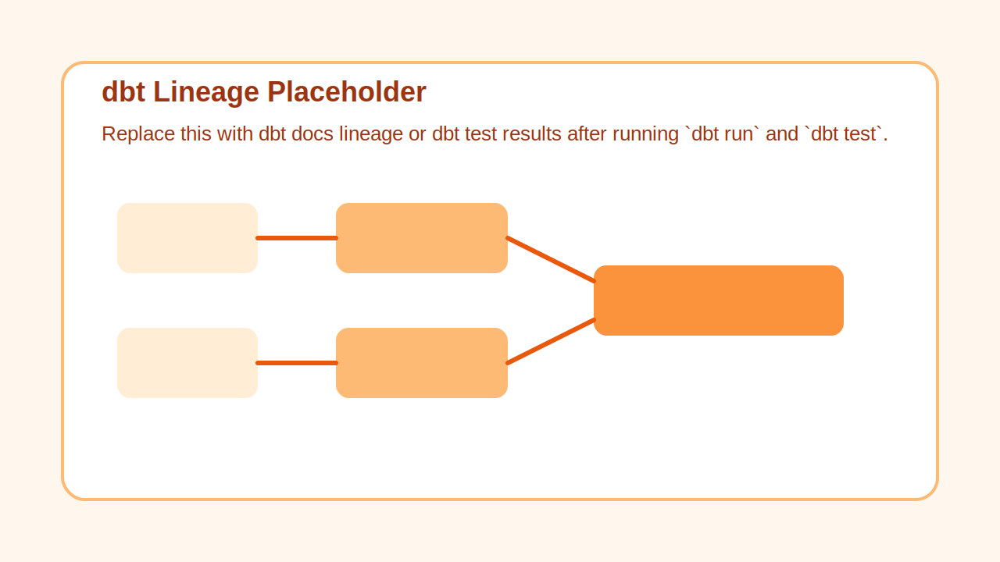
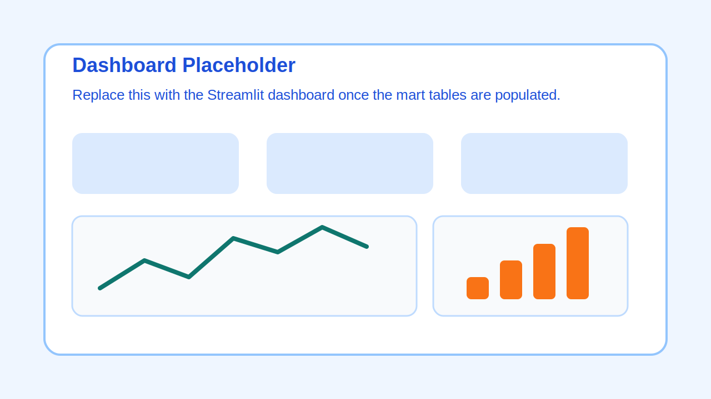

# TfL Cycle Demand Analytics


## Problem Statement

London's Santander Cycles network generates a large amount of trip activity every day, but raw journey files on their own do not answer practical questions very well:

- Which stations consistently act as the strongest departure hubs?
- How does daily demand evolve across weekdays, weekends, and seasonal windows?
- When do trip durations shift from short commute-style rides to longer leisure-style rides?

I wanted a capstone that reflects the data engineering topics covered in DataTalksClub's Data Engineering Zoomcamp while still solving a concrete transport analytics problem. This project turns monthly TfL journey extracts and live BikePoint station metadata into a reproducible batch analytics pipeline. The final output is a dashboard that helps explain how ride demand changes over time and across stations, with a repo structure designed for both local execution and a later GCP cutover.

## Overview

This repository implements an end-to-end batch data engineering project for the TfL Santander Cycle Hire dataset.

The pipeline:

1. Discovers and downloads monthly journey files from TfL cycling open data.
2. Pulls the latest BikePoint station snapshot from the TfL API.
3. Stores the raw payloads in a lake-style folder layout.
4. Normalizes and deduplicates the raw journey data into Parquet.
5. Loads the normalized data into DuckDB for local analytics.
6. Builds warehouse-ready tables and marts with dbt.
7. Exports dashboard-ready assets and serves a local Streamlit dashboard.

The stack intentionally follows the broader DE Zoomcamp path: Docker, Terraform, GCP-oriented architecture, BigQuery-oriented modeling, dbt, and Spark. The only deliberate deviation is workflow orchestration: this capstone uses Apache Airflow, while the current `main` branch of the Zoomcamp repo uses Kestra for orchestration.

## Table of Contents

- [Tech Stack](#tech-stack)
- [Project Architecture](#project-architecture)
- [Project Structure](#project-structure)
- [Data Source Overview](#data-source-overview)
- [Data Pipeline](#data-pipeline)
- [Data Quality & Testing](#data-quality--testing)
- [Insights & Visualizations](#insights--visualizations)
- [Steps to Reproduce](#steps-to-reproduce)
- [Contact Information](#contact-information)

## Tech Stack

### Docker
Docker provides the consistent execution layer for Airflow and the local runtime. The Airflow image is extended with Java, Spark dependencies, dbt adapters, and the project package so the same container can orchestrate ingestion, transformation, and export tasks without environment drift.

### Google Cloud Platform (Target Architecture)
The local implementation is the first milestone, but the repository is shaped for an eventual GCP deployment. Raw and silver layers can migrate to GCS, while the dbt warehouse layer can switch to BigQuery with the same model naming and downstream mart structure.

### Terraform
Terraform is included to provision the cloud target once GCP access is available. The initial infrastructure scope is intentionally small: one GCS bucket for lake storage, one BigQuery dataset for warehouse tables, and one service account for pipeline execution.

### Apache Airflow
Airflow is the orchestration entrypoint. Two DAGs are defined:

- `tfl_cycle_backfill` for manual historical loads over the fixed project backfill window
- `tfl_cycle_incremental` for the weekly refresh schedule

Each DAG follows the same task graph: discover source files, download raw journeys, fetch the latest station snapshot, normalize into partitioned Parquet, load DuckDB raw tables, run dbt staging, run dbt marts, export dashboard assets, and run quality checks.

### Apache Spark
Spark support is kept in the project for batch normalization and for a future cloud-oriented runtime. For the local Docker-first MVP, the default normalization engine is `pandas` because it is more stable on constrained laptop/container setups. The engine can be switched with `NORMALIZATION_ENGINE=spark` when the local environment is ready for it.

### DuckDB and BigQuery
DuckDB is used as the local warehouse profile so the project can run entirely on a laptop. BigQuery is already wired in as the cloud profile for the dbt project, allowing the same transformation layer to move to GCP later with minimal SQL changes.

### dbt
dbt builds the analytics layer:

- `stg_journeys`
- `stg_stations`
- `dim_station`
- `fct_trips`
- `mart_daily_ridership`
- `mart_station_popularity`
- `mart_duration_distribution`

This gives the project a warehouse structure that is easy to test, document, and plug into a dashboard.

### Streamlit
Streamlit is used for the first dashboard milestone because it works fully offline against the local warehouse. The app exposes the two required dashboard tiles from the capstone rubric, plus supporting KPI cards and filters, while keeping the mart layer reusable for a later Looker Studio version on BigQuery.

## Project Architecture



### Orchestration Flow

- `discover_source_files`
- `download_raw_journeys`
- `download_station_snapshot`
- `normalize_to_parquet`
- `load_duckdb_raw`
- `run_dbt_staging`
- `run_dbt_marts`
- `export_dashboard_dataset`
- `data_quality_checks`

### Screenshots

Airflow view placeholder:



dbt lineage placeholder:



Dashboard placeholder:



## Project Structure

```text
.
├── dashboard/
│   └── streamlit_app.py
├── dbt/
│   └── tfl_cycle_analytics/
│       ├── dbt_project.yml
│       ├── profiles.yml
│       └── models/
│           ├── staging/
│           └── marts/
├── docker/
│   └── airflow/
│       └── Dockerfile
├── orchestration/
│   └── dags/
│       └── tfl_cycle_pipeline.py
├── src/
│   └── tfl_cycle_analytics/
│       ├── cli.py
│       ├── config.py
│       ├── dbt_runner.py
│       ├── processing.py
│       ├── sources.py
│       └── warehouse.py
├── terraform/
│   ├── main.tf
│   ├── outputs.tf
│   ├── variables.tf
│   └── versions.tf
├── tests/
│   ├── integration/
│   ├── unit/
│   └── fixtures/
├── docker-compose.yml
├── pyproject.toml
└── README.md
```

## Data Source Overview

### 1. TfL Santander Cycle Hire Journey Data

- Source: [TfL cycling open data](https://cycling.data.tfl.gov.uk/)
- Type: monthly journey extracts
- Role in the pipeline: primary trip-level fact source

The project uses pattern-based source discovery rather than hardcoding individual file names. This matters because TfL file naming can vary slightly over time. The ingestion layer looks for cycle journey extract files, extracts a month token from the filename, filters them to the project backfill window, and stores the original payloads unchanged in the raw layer.

### 2. TfL BikePoint API

- Source: [TfL BikePoint API](https://api.tfl.gov.uk/BikePoint)
- Type: live station metadata and availability snapshot
- Role in the pipeline: station enrichment and dimension-building

The BikePoint snapshot is flattened into a station table with location and docking-related fields so trip facts can be joined to a cleaner station dimension.

## Data Pipeline

### 1. Ingestion

The ingestion module downloads raw journey files into `data/raw/journeys/` and station snapshots into `data/raw/stations/`. The raw layer intentionally preserves source files as-is to keep lineage clear and make troubleshooting easier.

### 2. Journey Normalization

The normalization layer standardizes source schema drift and creates canonical trip fields:

- `trip_id`
- `started_at`
- `ended_at`
- `started_date`
- `start_station_id`
- `end_station_id`
- `duration_seconds`
- `duration_band`
- `hour_of_day`
- `day_of_week`
- `is_weekend`

Output is written to `data/silver/journeys/` as partitioned Parquet by `year` and `month`.

### 3. Local Warehouse Load

The local warehouse loader creates:

- `raw.journeys` from silver Parquet
- `raw.stations_latest` from the latest flattened BikePoint snapshot

This is the bridge between file-based lake storage and the warehouse transformation layer.

### 4. dbt Transformation Layer

The dbt project builds the final marts:

- `stg_journeys`: cleaned source trips
- `stg_stations`: cleaned station snapshot
- `dim_station`: station dimension enriched with the latest snapshot plus historical journey station IDs
- `fct_trips`: trip fact table enriched with canonical station names
- `mart_daily_ridership`: time-series aggregate for dashboard line charts
- `mart_station_popularity`: station ranking aggregate
- `mart_duration_distribution`: duration bucket distribution

### 5. Dashboard Export

After dbt finishes, the pipeline exports key tables to `data/gold/` as Parquet. The Streamlit dashboard reads from the warehouse directly, and the Docker Compose stack exposes the app on port `8501`.

## Data Quality & Testing

### Unit Tests

Unit tests cover:

- source filename month parsing
- directory listing parsing
- duration derivation
- duration band assignment
- record deduplication

### Integration Tests

Integration tests cover:

- Spark normalization from sample raw CSV to silver Parquet
- Airflow DAG import and registration
- dashboard helper loading and aggregation

### dbt Tests

The dbt project includes:

- `not_null`
- `unique`
- `relationships`
- `accepted_values`

This protects the most important warehouse assumptions around trip keys, station keys, timestamps, and duration categories.

## Insights & Visualizations

The local Streamlit dashboard provides:

- one temporal tile: daily trip volume
- one categorical tile: top departure stations
- KPI cards: total trips, average duration, busiest hour
- filters: date range, weekday vs weekend, duration band

This layout is designed to satisfy the capstone minimum dashboard requirements while still being useful for exploration.

## Steps to Reproduce

### Prerequisites

- Docker Desktop
- Python 3.11 or 3.12 if you want to run the package outside Docker
- `make` optional but convenient
- GCP credentials only when you are ready for the cloud cutover

### 1. Clone the Repository

```bash
git clone <your-repo-url>
cd tfl-cycle-demand-analytics
```

### 2. Configure Environment Variables

```bash
cp .env.example .env
```

Review the values in `.env`. For the local-first phase, the most important settings are:

- `DEPLOY_TARGET=local`
- `LAKE_ROOT=./data`
- `DUCKDB_PATH=./warehouse/tfl_cycle_analytics.duckdb`
- `BACKFILL_START=2024-01-01`
- `BACKFILL_END=2026-02-28`
- `NORMALIZATION_ENGINE=pandas`

### 3. Build and Initialize Airflow

```bash
make airflow-init
```

This builds the custom Airflow image, initializes the metadata database, and creates the default admin user.

### 4. Start the Local Platform

```bash
make airflow-up
```

Airflow webserver:

- URL: [http://localhost:8080](http://localhost:8080)
- username: `airflow`
- password: `airflow`

### 5. Run the Pipeline

#### Backfill

In the Airflow UI:

1. Open `tfl_cycle_backfill`
2. Trigger the DAG with parameters:
   - `start_date=2024-01-01`
   - `end_date=2026-02-28`

#### Incremental

`tfl_cycle_incremental` is scheduled weekly on Saturday at `09:00` Asia/Jakarta.

### 6. Run the Dashboard

After the mart tables are populated:

```bash
make dashboard
```

Dashboard URL:

- [http://localhost:8501](http://localhost:8501)

### 7. Run Tests

```bash
pytest
```

### 8. Optional GCP Cutover

When GCP billing and credentials are ready:

1. Update `.env` with your `GCP_PROJECT_ID`, `GCS_BUCKET`, `BQ_DATASET`, and `GOOGLE_APPLICATION_CREDENTIALS`
2. Provision infrastructure:

```bash
cd terraform
terraform init
terraform plan -var="project=<your-project-id>" -var="gcs_bucket_name=<your-bucket>"
terraform apply -var="project=<your-project-id>" -var="gcs_bucket_name=<your-bucket>"
```

3. Switch the target:

```bash
export DEPLOY_TARGET=gcp
```

This repository is already shaped for that move, but the local-first workflow is the supported first milestone.

## Contact Information

Replace this section with your public portfolio contact details before publishing the project.

- Name: `Maulana Yusri`
- Email: `ehmaulagi5@gmail.com`
